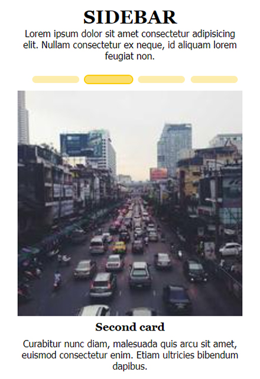

# Web Page 1

This web page has header, main, aside and footer. Page markup is done using CSS display: flex and has responsive design. [DEMO link](https://kulyk-volodymyr.github.io/web-page-1/)

The header section contains a slideshow created using pure CSS. The image in it changes every 5 seconds.

The background image in the main section has a parallax effect. The section contains 12 cards with the following hover effect: the image unfolds like a book and flickers inside.

Images in sidebar and footer have a zoom effect on hover. On a small screen (less than 768 pixels wide), the sidebar looks like a slide show.

All images are taken from [Lorem Picsum](https://picsum.photos/).
